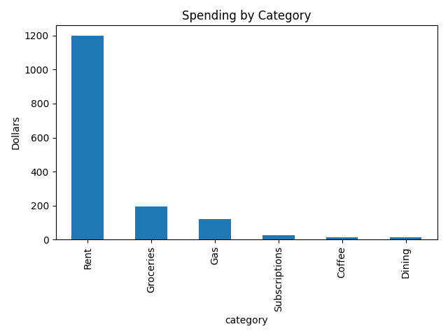

markdown# Spending Tracker

A small Python tool that reads a list of transactions, automatically sorts each one into a category (groceries, gas, rent, etc.), totals the spending per category, and charts where the money went.

I built this because I started covering my own rent and bills and wanted a clear answer to "where is my money actually going?"

## What it does

- Reads transactions from a CSV file
- Cleans the descriptions so they're easy to match
- Labels each transaction with a category using keyword rules
- Totals the spending per category
- Saves a bar chart of the results

## Result

## Tech

- Python
- pandas — data handling
- matplotlib — charting

## How to run it

1. Clone this repo and open the folder
2. Create and turn on a virtual environment:
python3 -m venv venv
source venv/bin/activate
3. Install the libraries:
pip install pandas matplotlib
4. Run it:
python analyze.py

## What I learned

- Loading and cleaning tabular data with pandas
- Writing a simple rules-based classifier to label text
- Grouping, summing, and visualizing data with matplotlib

## What I'd improve next

- Handle real, messy bank exports (inconsistent names, duplicates)
- Replace the keyword rules with a simple machine-learning classifier
- Add a web dashboard (Streamlit) so anyone can upload their own CSV